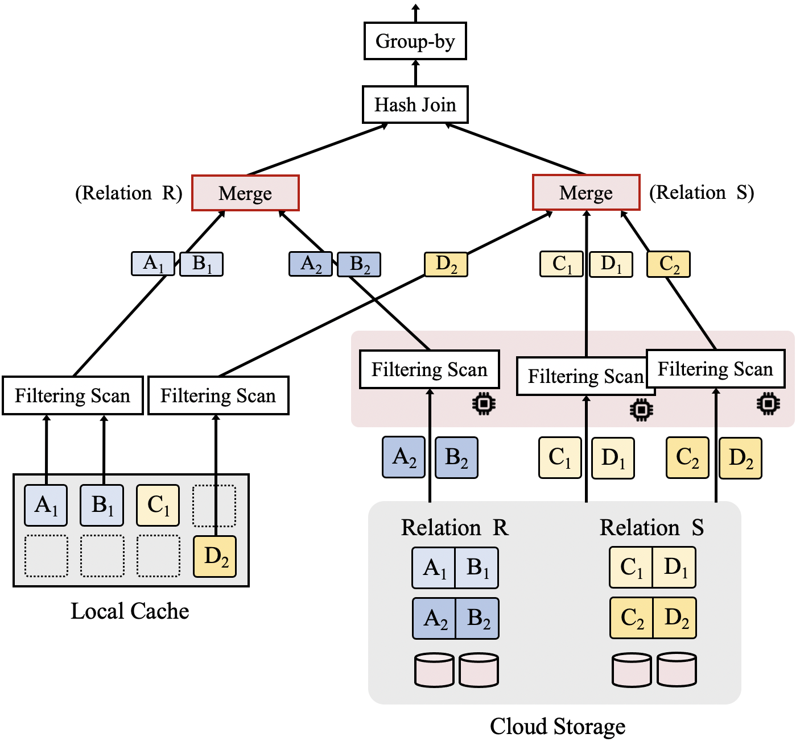

# FlexPushdownDB Hybrid Pushdown and Caching in a Cloud DBMS

# 问题

+ ~~scale the storage layer horizontally是啥？~~
  + service等东西可以直接加数量，不需要额外操作 (解耦合)
+ ~~Base table aggregation？好像不需要都在里面就可以用吧(例如sum)~~
  + 这玩意可以算比较特殊的情况
+ example里面的执行顺序？最后是select嘛(优化过后？)
+ ~~是按照优化树的BFS/DFS顺序进行访问的嘛？~~
  + 是的
+ selectivity是啥？

# 1. 背景、难题与研究现状

## 1.1 背景与难题

​	当前，分布式数据存储系统有两种结构：

+ 如下图(a)所示的无分享结构，它是最佳的(？)
+ 如下图(c)所示的存储-计算分离结构，开销低、容错简单、硬件利用率高。同时，存储层还有一定的计算能力，能够将一些简单的过滤、聚合操作下推到存储层进行，从而减少开销。不同于类似(b)的共享磁盘结构，(c)能够 scale the storage layer horizontally？
+ 共性：使用网络(Network)进行连接

然而，我们发现犹豫(c)需要使用网络来进行存储与计算交互，而网络的带宽显著著低于IO，因而(c)的性能也明显低于(a)，需要我们进行改进。


## 1.2 研究现状

​	对于存储与计算交互，目前有两种解决方案：

+ 缓存(Caching)：如下图(a)所示，将hot的数据存储在计算节点的cache上，在计算需要使用到时直接使用cache中数据。在hit的时候速度很快，miss时由于网络带宽显著低于IO带宽，因而较慢
+ 下推计算(Computation Pushdown)：如下图(b)所示，将计算下移到存储节点上，理由是内部的数据交互显著快于用网络进行交互。
+ 问题：这两个策略通常只能选择其一，而没有兼容的选项。前者在cache容量较小时会造成较大的网络交互开销，后者完全忽视了cache，导致性能不随cache改变。一个理想的选项是将二者进行糅合，但是目前的粒度停留在表级，而没法到列的级别等更细的粒度。
  + 分解查询，使得能够在更细粒度兼容cache与pushdown
  + 设置新的cache策略，让pushdown能够兼容cache


​	由此，我们提出了FlexPushdownDB(FPDB)，用以解决上述问题。我们提出了如下东西：

+ 可分离的操作符：将某些操作符(例如过滤、投影)进行分离，在cache与pushdown上同时进行操作，再利用我们提出的merge操作符进行结果合并
+ 改进的cache策略：用于兼容pushdown。传统的cache会在miss时加载缺失块，但我们直接将miss的进行pushdown，其开销不固定，以此带来改进空间。我们称为Weighted-LFU(Least Frequently Used)

由此形成贡献：(这两是一个东西吧？为了合并，必须进行cache的改进)

+ 合并了pushdown与cache，性能大幅提升
+ 改进了cache策略，在分布式数据库上显著优于LFU、LRU等

# 2. 系统结构

## 2.1 总览

​	FPDB由两个模块构成：

+ 混合的查询执行器(Hybrid Query Executor)：根据cache中的内存，将执行计划进行分解，一部分在cache中执行一部分pushdown到存储执行，merge之后传给下一个计算
+ 缓存管理(Cache Manager)：决定哪些数据需要被缓存，哪些需要被排除。每次查询时都会更新cache的元数据(访问频次等)。在此我们仅存储表格数据(例如原始数据、行、列等)，而不存储结果(包括中间结果与最终结果，这留给未来探索)。我们的最小存储单元是段(Segment)，由表名(Table Name)，划分名(Partition Name，利用主码等值对表格进行水平分解得到)与列名(Column Name)。

## 2.2 Hybrid Query Executor

​	包括操作符分解与结果合并(merge)。

### 2.2.1 可分解的操作符与查询(对于单一操作符，如何执行)

​	当一个操作符可以利用cache与云端数据获得正确结果时，我们称它是可分解的。下面仅分析简单的操作符：

+ 投影：显然可以分解。只需要把缺了的pushdown即可补上。
+ 选择：视cache情况决定是否可分解。假定选择的谓词(Predicate)只涉及A，但我们需要返回A、B，则：
  + cache中有A、B的全体：直接使用cache
  
  + cache中只有A的部分：无法分解，要么pushdown，要么load到cache
  
  + cache中有A的全体与B的部分：可分解
  
  + 一个例子
  
    ```sql
    select A.b
    from A, B
    where A.a < B.c
    ```
+ 基础的表聚合：例如count、sum、avg、max等，也是可分解的。若涉及的所有数据都在cache中，则直接聚合；否则可以直接pushdown(？)。对于avg等，可以先各自求出count与sum，再merge
+ hash连接：
  + 建立阶段(Building Phase)：选择某个表，对其连接属性进行hash以得到一个hash表。它是不可分解的，本分区所有连接的列都需要加载到计算节点中，用于计算hash值并用于下一阶段的查询。(可能因为需要频繁查询，所以不能分解？)
  + 探测阶段(Probing Phase)：对另一个表每一行的连接属性进行hash，若有与上述hash表相同的项，则看是否满足谓语条件(Predicate)。它是显然可分解的，可以分别在cache与cloud进行在merge即可。
+ 排序：理论上可行，只需各自排序然后合并即可。但由于现在云端存储不支持排序，故FPDB也不支持排序的分解。

​	而当一个查询含有可分解的操作符，我们称其为可分解查询。我们根据cache挑选出可分解的操作符，然后分别cache与cloud操作，再merge。为了提升性能，我们使用多线程进行merge操作，分为全cache、全cloud、混合着三种情况。线程之间的结果不一定要merge到一起，而是可以直接传给下一操作符。

### 2.2.2 一个例子

​	假如我们执行以下操作：

```sql
select R.B, sum(S.D)
from R, S
where R.A = S.C and R.B > 10 and S.D > 20
group by R.B
```

​	如下图所示为R、S的情况。R有两个属性A、B，2个分区，同时cache中有A1、B1；S有两个属性C、D，2个分区，同时cache中有C1、D2。我们假定|R|<|S|，这样在hash连接时从R开始。



+ 过滤：完成`R.B > 10 and S.D > 20`。注意到该过程可以并行。

  + R：R的第一个分区在cache完成，第二个分区pushdown到cloud完成

  + S：由于cache中只含有C1而没有我们需要的D1，因而我们将S的第一个分区pushdown到cloud；而第二个分区D2在cache中，我们有两种选择：

    + 分别在cloud与cache中进行选择，从local中得到C2，从cache中得到D2再合并为完整的分区
    + 直接pushdown到cloud进行

    前者会对谓词进行两次计算，但网络开销更小，在此我们选择前者。

+ hash连接：完成`R.A = S.C`。注意到该过程S需要先等R扫描结束后再进行。我们有两种方案：

  + 如图所示，先各自过滤完合并后再进行hash连接
  + 或者，让R扫描完经过Building Phase建立hash表，将hash表作为S的谓词过滤条件在cache或cloud上过滤

### 2.2.3 执行计划生成(对于含有多个操作符，如何执行)

​	我们提出这样两个假设：

+ 在cache上处理数据要快于pushdown到cloud进行处理再返回。这是因为cache的计算能力要由于cloud存储端的计算能力。
+ pushdown到cloud进行处理再返回要快于fetch数据到local再处理。这是因为网络带宽是低于IO带宽的，而一般处理完的数据量少于fetch时的所有数据量。

​	基于这两个假设，我们生成执行计划。首先，对执行计划进行优化，再根据cache找出可分解的操作符。对于可分解操作符，我们先尽可能利用cache中的数据，再尽可能地pushdown到cloud中运行。而对于操作符不可分解等既无法利用cache也无法pushdown的情况，我们只能采取传统cache的手段——将所有需要的数据拉取到local再处理。

​	这两个假设虽然简单有效，但有时候并非最优。例如，pushdown有时候能够利用高并发度的优势而快过cache。我们未来的工作要完成pushdown-aware的查询优化，以更好地覆盖情况、提升性能。

## 2.3 Cache Manager

​	一个想法：能够被pushdown加速的segment在cache中的权重较低，因为cache获得的收益并不高；而不能被加速的则应该提高权重以保留在cache中。

### 2.3.1 与Hybrid Query Executor的联系

​	如下图所示为二者结合的流程。首先，我们找到优化后的query需要访问的segment，将其发送给cache manager，用于更新元数据以决定哪些需要被admit，哪些需要被evict，之后执行query。对于hit，我们直接使用cache；对于miss，我们有两种情况：

+ cache manager决定不load数据，则直接pushdown到cloud。
+ cache manager决定load数据，则直接等待数据load到local而不会pushdown，以尽可能减少网络延迟(在下文实验中得到了反映)。


### 2.3.2 算法框架

​	我们的cache算法决定需要admit或evict哪些segment。我们为每一个segment s都设置了缓存它的价值s.benefit，以反映保留s能够获得的收益。不同算法间的区别大多仅在benefit值的计算上有差别。

​	如下图所示为我们算法的框架。首先，我们对新访问的segment集合$S_{in}$更新每个segment.benefit(第1\~2行)，之后按照benefit降序访问每一个不在cache中、需要被访问的segment(第3\~12行)。若cache有充足的空间，则直接将load segment即可(第4\~6行)；否则，我们需要不断移除当前cache中benefit过低的segment，以腾出空间给新访问的segment(第7\~12行)。


​	注意到需要load segment时，我们会立即执行。同时，我们的策略是贪婪的，会尽可能让最大benefit的segment存储在内存中，这也是降序的原因。

### 2.3.3 传统cache与我们的策略

​	我们介绍三种传统cache算法：

+ LRU(Least Recently Used)：核心思想为最近越经常使用的segment越可能在不久后被使用，因而越应该放在cache中，$benefit = timestamp$，但忽视了不同段的大小segment.size。

+ LFU(Least Frequently Used)：反映访问的频次。每个segment.benefit初始化为0，每当一个segment被访问时，其$benefit = benefit + \frac{1}{segment.size}$，将频次按照段大小归一化。当访问的段不在cache中且segment.benefit > 最小的benefit时，会不断evict直到“>”关系不满足或访问的segment能够放下。

+ Belady：假定所有的segment都具备相同大小且miss代价完全相同下的最佳cache算法。核心思想为窥探未来segment的使用情况，evict下一次访问时间最远的segment，有$benefit = \frac{1}{n}$，其中$n$表示对于segment下次访问需要经历多少其他query。

  然而，由于FPDB与假定的情况不同，因而Belady不再是最佳算法。我们在此仅用来与我们的算法进对比。

​	考虑到FPDB对于不同segment的开销不同，因而我们采用加权的LFU来衡量benefit。在每次递增时，我们不再采用$\frac{1}{segment.size}$，而是使用weight，该值取决于segment能否被pushdown以及pushdown的花费。显然，若一个segment被pushdown的花费越大，则我们越应该将其保留在cache中进行访问而非pushdown。我们采用一种直观的方法来恒定weight，定义为pushdown花费的时间，再对size进行归一化，即：
$$
w(s) = \frac{t(s)}{size(s)}
$$
​	而pushdown的访问时间又可以分解为网络传输开销$t_{net}(s)$，数据扫描开销$t_{scan}(s)$，计算开销$t_{com}(s)$，因而我们有：
$$
w(s) = \frac{t(s)}{size(s)} = \frac{t_{net}(s) + t_{scan}(s) + t_{com}(s)}{size(s)}
$$
这三个开销分别定义为：
$$
\begin{aligned}
t_{net}(s) &= \frac{selectivity(s) \times size(s)}{BW_{net}} \\
t_{scan}(s) &= \frac{N_{tuples}(s) \times size(tuple)}{BW_{scan}} \\
t_{com}(s) &= \frac{N_{tuples}(s) \times N_{predicates}}{BW_{com}}
\end{aligned}
$$
其中，$BW_{net}, BW_{scan}, BW_{com}$代表计算带宽或传输带宽，需要在最开始时使用人工查询来恒定他们的值；$size(s)$代表segment大小，$N_{tuples}(s)$代表元组数，$size(tuple)$代表元组大小，都可以从统计数据中静态确定；而$selectivity(s)$？？？？？

## 2.4 具体实现

​	我们使用C++实现FPDB，代码在https://github.com/cloud-olap/FlexPushdownDB.git开源。

### 2.4.1 云端环境

​	我们使用AWS Simple Storage Service (S3，一个storage server，通过API进行访问，节省工作量)作为云端存储服务，并使用S3特性，能够将投影、选择、基础的表聚合pushdown到S3上进行。FPDB现在仅支持单一的计算阶段。FPDB通过AWS C++SDK从S3请求数据。我们在AWS客户端配置中配置了足够高的速率限制、超时和连接，以实现更好的性能。此外，FPDB不使用HTTPS/SSL。

### 2.4.2 数据格式

+ cloud中的表格支持CSV与Parquet格式
+ cache与数据库引擎中为Apache Arrow(==了解一下这玩意==)
+ 在执行器(Executor)中，我们将Arrow封装为Array

### 2.4.3 内存并行处理

+ 表达式求值：(一个优化器，只会用就🆗了)使用Gandiva来编译与对表达式求值，表达式为Arrow格式。它使用LLVM来执行向量化处理与即时的编译，用于**加速**与并行化。我们使用多线程来执行表达式，而对于编译仅连续地进行而不适用多线程。SIMD：硬件特性，支持并行化流处理(将处理流程做成汇编，用以加速)

+ Actor-Based并行处理：(计算节点与存储节点之间有大量通信，需要高可靠系统来保证信息传输可靠性，可以把所有模块都抽象为一个actor)使用C++ Actor Framework(CAF)来进行并发操作。由于query实际上是组成树状结构，每一个节点会形成若干actor(详细见6.3 In-Memory Parallel Processing的Actor-Based Parallel Processing)通过message机制进行交流，数据流从叶子节点流向根节点(此即是处理过程？)。

  在处理时，会有一个corrdinator指导所有的操作符开始并发执行，从上游操作符获取信息并将输出信息转发给下流消费者。在所有操作符执行完成后，coordinator将query结果发送给client。而并行的hash join与聚合会在FPDB中进行。(这一段不是很懂。。)

+ 缓存：我们使用计算节点中的主存RAM作为cache。我们也将cache实现为actor，通过message机制来传递segment的admit、evict信息。

## 3. 实验评估

​	本节主要围绕以下四个问题：

+ 混合结构与baseline的表现差异
+ Weighted-LFU与其他传统cached策略的表现差异
+ 网络带宽的影响
+ FPDB的资源使用率与成本(多少钱)

## 3.1 实验设置

+ 服务器配置：我们在AWS EC2 compute-optimized中选定了两款进行实验，分别为c5a.8xlarge与c5n.9xlarge，默认为前者。
+ benchmark：采用了Star Schema Benchmark(SSB，详情见文章7.1 Benchmark)作为数据集，并以此为基础实现了随机查询生成。其中，$\theta$作为参数决定了偏度，$\theta$越大代表访问某些数据的批次越高，即hot数据越少。
+ 评估：先用50个query进行warmup以填充cache，再用50个query执行我们的实验
+ 性能对比：包括以下四种架构，均在FPDB中得到了实现
  + Pullup：无cache与pushdown，每次都从S3中load数据再计算
  + Caching-Only：仅有cache而没有pushdown
  + Pushdown-Only：仅有pushdown而没有cache，选择过滤总是进行pushdown
  + Hybrid：cache与pushdown混合，即本文实现的架构

## 3.2 性能评估

​	本节先比较不同架构query的执行时间，再评估Weighted-LFU的有效性，最后评估网络带宽对计算节点与存储节点的影响。

### 3.2.1 架构比较

​	我们针对不同架构，采用不同的cache size或$\theta$，在c5a.8xlarge与c5n.9xlarge上进行测试。

#### 总体表现

​	如下所示为c5a.8xlarge。我们有如下发现：

+ 图(a)的cache size实验
  + pullup与pushdown不受cache size影响
  + pushdown显著优于pullup，因为网络开销更小
  + cache size越大，caching-only的表现越好，且在cache size较小时，性能接近pullup，在cache size较大时，由于较高的hit而由于pushdown
  + hrbid显著优于其他策略。在cache size较小时表现接近pushdown，在cache size较大时表现接近caching-only，在中间时能够取二者之长而优于二者
+ 图(b)的$\theta$实验
  + pullup与pushdown基本不受影响
  + hybrid与caching-only随着$\theta$增大而表现更好，因为hot数据更少，hit更高


​	如下图为c5n.9xlarge，结果与上述类似，详情参见7.2.1 Caching and Pushdown Architectures的Overall Performance。


​	由此，我们发现hybrid能兼容pushdown与cache的长处，从而优于二者与pullup。

#### 查询分析

​	我们把查询类型分为cache优于pushdown、cache接近pushdown、cache逊色于pushdown这三类，以进一步分析hybrid的表现，结果如下所示。


​	我们发现在所有分类中，hybrid都优于其他。在pushdown更优时，hybrid优于它；在cache更优时，hybrid优于它；在二者接近时，依旧优于它们。这是hybrid在query时优于它们的原因(因为处处优于它们。。)

#### 与现有策略对比

​	比较FPDB与现有的策略——Presto，详细设置见7.2.1 Caching and Pushdown Architectures的Comparison against Existing Solutions。如下表所示，我们发现FPDB在各方面都优于Presto，而优于Presto不支持hybrid，故不比较。


### 3.2.2 Parquet格式下的性能(不是很懂这个在干什么。。)

​	Parquet与CSV最主要的差别在于网络负载与pushdown处理的速度、我们同样在两个服务器下比较Parquet格式与CSV格式，结果如下所示。我们发现，Parquet在相同情况下优于CSV，并且在pushdown-only、hybrid与网络带宽较低下更为显著。而Hybrid在所有情况下都依然能够取得最佳性能。(详细见7.2.2 Parquet Performance)


### 3.2.3 WLFU cache策略

​	我们对比LFU、Belady与WLFU(因为LRU性能比较糟糕)。同时修改SSB，让query对不同列的访问次数不同(详细见7.2.3 Weighted-LFU Caching Policy，可能原因是比较接近时会对整个segment进行计算，导致每个segment的pushdown cost都很接近，无法正确反映WLFU的性能)。结果如下图所示。

​	我们发现，WLFU显著优于LFU与Belady，并且进一步实验说明WLFU能够显著降低网络拥塞(详细见7.2.3 Weighted-LFU Caching Policy)。同时，$\theta$越大，hot的数据越少，hit的概率越高，导致越来越多的hot数据能够被存储在cache中，使得WLFU的性能提升效果下降(更低的时候cache更新更频繁，更能体现WLFU的效果)。这说明WLFU cache策略是相当有效的。


### 3.2.4 网络带宽的影响

​	本次讨论计算节点与存储节点间的网络带宽对性能的影响。我们在c5n.9xlarge上探究，结果如下图所示。


+ 架构：在此我们忽略掉性能最糟糕的pullup。我们发现，网络带宽越低，$t_{net}(s)$越大，WLFU的更新也随之放缓，使得网络开销相比于caching-only与pushdown-only来得更低，并且hybrid的表现在所有带宽中都是最佳的。(实验设置与文中7.2.1节相同)
+ cache策略：我们在hybrid架构上测试LFU、Belady、WLFU。在实验中，我们设置$\theta = 0$，以产生更多的hot数据，减少hit(用以保证cache策略能够发挥作用，否则miss次数太少则网络transfer也减少，也就难以看出差别)。我们发现WLFU的表现是最佳的，并且随着带宽降低，其与LFU、Belady的差别也越大。原因在于高额网络开销抑制了频繁的transfer，从而不会因次数而产生高额的网络开销。

## 3.3 资源使用与消耗情况

​	==TODO==

# 4. 总结

​	==TODO==

