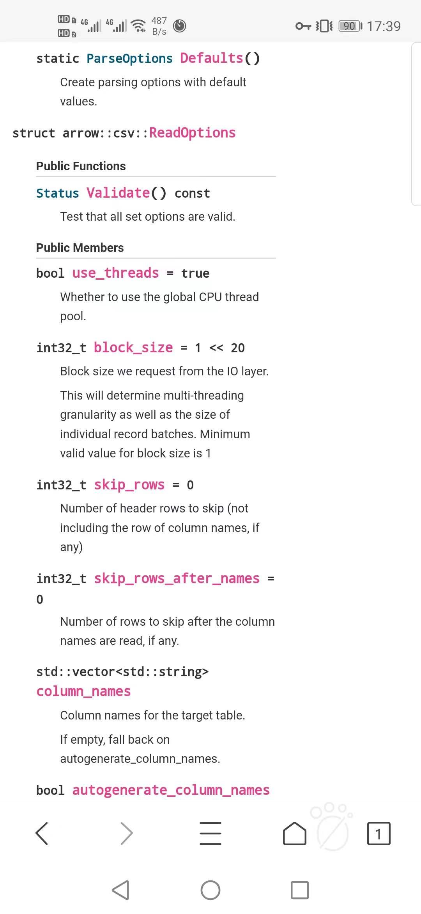

# background

+ shared_ptr是一种智能指针（smart pointer），作用有如同指针，但会记录有多少个shared_ptrs共同指向一个对象。这便是所谓的引用计数（reference counting）。一旦最后一个这样的指针被销毁，也就是一旦某个对象的引用计数变为0，这个对象会被自动删除。可以使用std::make_shared方法来产生

# readCSVFile重写

​	FileScanPOp.cpp中的std::shared_ptr\<TupleSet\> FileScanPOp::readTuples()也需要读CSV文件，但是他远比S3GetPOp.cpp中的std::shared_ptr\<TupleSet\> S3GetPOp::s3GetFullRequest()简单，因而我们从前者开始。

## FileScanPOp::readTuples()

+ 用到了FileScanPOp.h中的filePath\_，实际上filePath\_只是一个字符串(但是它的含义是？)。filePath\_就引用tpch-degen/data/tpch-sf1下的即可，包括customer, nation, oartsuoo, region, orders, part, supplier等tbl格式的csv文件。
+ 需要安装Apache Arrow，用于arrow::io::InputStream
+ 需要引入ArrowAWSGZIPInputStream2.h这个头文件
+ 总结：==需要用远程服务器==

```c++
std::shared_ptr<TupleSet> FileScanPOp::readTuples() {
	std::fstream retrievedFile(this->filePath_);//将retrievedFile直接初始化为FileScanPOp的filePath_, filePath_是字符串

  std::shared_ptr<arrow::io::InputStream> inputStream = std::make_shared<ArrowAWSGZIPInputStream2>(retrievedFile);
  auto tupleSet = readCSVFile(inputStream);
  return tupleSet;
}
```

## readCSVFile

+ TupleSet是新定义的，需要引入TupleSet.h与TupleSet.cpp

+ 需要安装Apache Arrow，用于arrow::io

+ 如下图所示，skip_rows应该为0吧。getProjectColumnNames()可以手动改成std::vector\<std::string\>进行测试。

+ columnType暂时不知道怎么处理，直接忽略掉

  

```c++
std::shared_ptr<TupleSet> S3GetPOp::readCSVFile(std::shared_ptr<arrow::io::InputStream> &arrowInputStream) {
  auto ioContext = arrow::io::IOContext();
  auto parse_options = arrow::csv::ParseOptions::Defaults();
  auto read_options = arrow::csv::ReadOptions::Defaults();
  read_options.use_threads = false;
  read_options.skip_rows = 1; // Skip the header
  read_options.column_names = getProjectColumnNames();
  auto convert_options = arrow::csv::ConvertOptions::Defaults();
  std::unordered_map<std::string, std::shared_ptr<::arrow::DataType>> columnTypes;
  for(const auto &columnName: getProjectColumnNames()){
	  columnTypes.emplace(columnName, table_->getSchema()->GetFieldByName(columnName)->type());
  }
  convert_options.column_types = columnTypes;
  convert_options.include_columns = getProjectColumnNames();
    
  //从此处开始, 为Apache Arrow读取csv的example

  // Instantiate TableReader from input stream and options
  auto makeReaderResult = arrow::csv::TableReader::Make(ioContext,
														arrowInputStream,
														read_options,
														parse_options,
														convert_options);
  if (!makeReaderResult.ok())
	  ctx()->notifyError(fmt::format(
            "Cannot parse S3 payload  |  Could not create a table reader, error: '{}'",
            makeReaderResult.status().message()));
  auto tableReader = *makeReaderResult;
    
  //从此处开始, 与example不一致

  // Parse the payload and create the tupleset
  auto expTupleSet = TupleSet::make(tableReader);
  if (!expTupleSet.has_value()) {
    ctx()->notifyError(expTupleSet.error());
  }
  return *expTupleSet;
}
```

+ TupleSet::make溯源
  + TupleSet.cpp的std::shared_ptr\<TupleSet\> TupleSet::make(const std::shared_ptr\<arrow::Table\> &table)方法
  + TupleSet.cpp的TupleSet::TupleSet(std::shared_ptr\<arrow::Table\> table)方法，将table里面所有的东西转给table\_

# Example

+ 读入

  ```c++
  #include "arrow/csv/api.h"
  
  {
     // ...
     arrow::io::IOContext io_context = arrow::io::default_io_context();
     std::shared_ptr<arrow::io::InputStream> input = ...;
  
     auto read_options = arrow::csv::ReadOptions::Defaults();
     auto parse_options = arrow::csv::ParseOptions::Defaults();
     auto convert_options = arrow::csv::ConvertOptions::Defaults();
  
     // Instantiate TableReader from input stream and options
     auto maybe_reader =
       arrow::csv::TableReader::Make(io_context,
                                     input,
                                     read_options,
                                     parse_options,
                                     convert_options);
     if (!maybe_reader.ok()) {
        // Handle TableReader instantiation error...
     }
     std::shared_ptr<arrow::csv::TableReader> reader = *maybe_reader;
  
     // Read table from CSV file
     auto maybe_table = reader->Read();
     if (!maybe_table.ok()) {
        // Handle CSV read error
        // (for example a CSV syntax error or failed type conversion)
     }
     std::shared_ptr<arrow::Table> table = *maybe_table;
  }
  ```

+ 写入

  ```c++
  #include <arrow/csv/api.h>
  {
      // Oneshot write
      // ...
      std::shared_ptr<arrow::io::OutputStream> output = ...;
      auto write_options = arrow::csv::WriteOptions::Defaults();
      if (WriteCSV(table, write_options, output.get()).ok()) {
          // Handle writer error...
      }
  }
  {
      // Write incrementally
      // ...
      std::shared_ptr<arrow::io::OutputStream> output = ...;
      auto write_options = arrow::csv::WriteOptions::Defaults();
      auto maybe_writer = arrow::csv::MakeCSVWriter(output, schema, write_options);
      if (!maybe_writer.ok()) {
          // Handle writer instantiation error...
      }
      std::shared_ptr<arrow::ipc::RecordBatchWriter> writer = *maybe_writer;
  
      // Write batches...
      if (!writer->WriteRecordBatch(*batch).ok()) {
          // Handle write error...
      }
  
      if (!writer->Close().ok()) {
          // Handle close error...
      }
      if (!output->Close().ok()) {
          // Handle file close error...
      }
  }
  ```


# 测试版本

```c++
#include <fpdb/executor/physical/file/FileScanPOp.h>
#include <fpdb/executor/physical/Globals.h>
#include <fpdb/executor/physical/PhysicalOp.h>
#include <fpdb/executor/physical/cache/CacheHelper.h>
#include <fpdb/executor/message/Message.h>
#include <fpdb/catalogue/format/CSVFormat.h>
#include <fpdb/executor/message/TupleMessage.h>
#include <fpdb/catalogue/local-fs/LocalFSPartition.h>
#include <fpdb/tuple/TupleSet.h>
#include <arrow/csv/options.h> 
#include <arrow/csv/reader.h>
#include <arrow/io/buffered.h>
#include <arrow/io/api.h>
#include <arrow/io/memory.h>
#include <arrow/type_fwd.h>            // for default_memory_pool
#include <arrow/csv/api.h>
#include <parquet/arrow/reader.h>
#include <memory>                      // for make_unique, unique_ptr, __sha...
#include <utility>
#include <filesystem>
#include <fpdb/tuple/arrow/CSVToArrowSIMDStreamParser.h>
#include "fpdb/tuple/arrow/ArrowAWSGZIPInputStream2.h"
using namespace fpdb::executor::physical::cache;
using namespace fpdb::executor::message;
using namespace fpdb::tuple;
using namespace fpdb::catalogue::format;

namespace arrow { class MemoryPool; }

std::vector<std::string> getProjectColumnNames() {
    std::vector<std::string> res = *new std::vector<std::string>;
    res.push_back("N_NATIONKEY");
    res.push_back("N_NAME");
    res.push_back("N_REGIONKEY");
    return res;
}

std::shared_ptr<TupleSet> readCSVFile(std::shared_ptr<arrow::io::ReadableFile> &arrowInputStream) {
    auto ioContext = arrow::io::IOContext();
    auto parse_options = arrow::csv::ParseOptions::Defaults();
    auto read_options = arrow::csv::ReadOptions::Defaults();
    read_options.use_threads = false;
    auto convert_options = arrow::csv::ConvertOptions::Defaults();
    /*
    std::unordered_map<std::string, std::shared_ptr<::arrow::DataType>> columnTypes;
    for(const auto &columnName: getProjectColumnNames()){
        columnTypes.emplace(columnName, table_->getSchema()->GetFieldByName(columnName)->type());
    }
    convert_options.column_types = columnTypes;
    */
    convert_options.include_columns = getProjectColumnNames();
    parse_options.delimiter = '|';
    // Instantiate TableReader from input stream and options
    auto makeReaderResult = arrow::csv::TableReader::Make(ioContext,
                                                            arrowInputStream,
                                                            read_options,
                                                            parse_options,
                                                            convert_options);
    if (!makeReaderResult.ok()) {
        /*
        ctx()->notifyError(fmt::format(
                "Cannot parse S3 payload  |  Could not create a table reader, error: '{}'",
                makeReaderResult.status().message()));
        */
        cout << "Error 1!" << endl;
    } else {
        cout << "Success 1!" << endl;
    }
    std::shared_ptr<arrow::csv::TableReader> tableReader = *makeReaderResult;

    // Parse the payload and create the tupleset
    /*
    auto expTupleSet = TupleSet::make(tableReader);
    if (!expTupleSet.has_value()) {
        ctx()->notifyError(expTupleSet.error());
    }
    */
    auto maybe_table = tableReader->Read();//std::shared_ptr<Table>
    auto res = maybe_table.ValueOrDie();
    if (!maybe_table.ok()) {
        cout << "Error 2!" << endl;
    } else {
        cout << "Success 2!" << endl;
    }
    cout << res->num_rows() << endl;
    cout << res->num_columns() << endl;
    return nullptr;
    //return *expTupleSet;
}

//string filePath = "//home//huazhang//czk_test//tpch-dbgen//data//tpch-sf1//nation.tbl";

int main() {
    auto inFile = std::filesystem::absolute("/home/test/czk_test/tpch-dbgen/data/tpch-sf1/nation.tbl");
    auto expectedInFile = arrow::io::ReadableFile::Open(inFile, arrow::default_memory_pool());
    auto inputStream = *expectedInFile;
    /*
    std::fstream retrievedFile("/home/test/czk_test/a.csv", ios::in|ios::out);
    //std::fstream retrievedFile("/home/test/czk_test/tpch-dbgen/data/tpch-sf1/nation.tbl", ios::in|ios::out);
    if (retrievedFile.is_open()) {
        cout << "Open Success!" << endl;
    }
    std::shared_ptr<arrow::io::InputStream> inputStream = std::make_shared<ArrowAWSGZIPInputStream2>(retrievedFile);
    */
    auto tupleSet = readCSVFile(inputStream);
    //retrievedFile.close();
    return 0;
}

```

